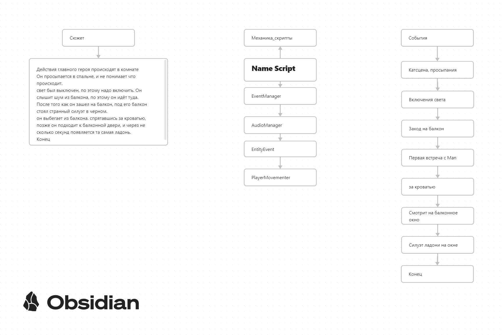

# DreaBalcony
<!DOCTYPE html>
<html lang="ru">
<head>
    <meta charset="UTF-8">
    <meta name="viewport" content="width=device-width, initial-scale=1.0">
</head>
<body>
    <h4>Mechanic Core</h4>
    
    

        Большое количество времени я потратил на создание моделей.
        

        ENG
        The most a cout time, I lost on an create a models
        

    

</body>
</html>
